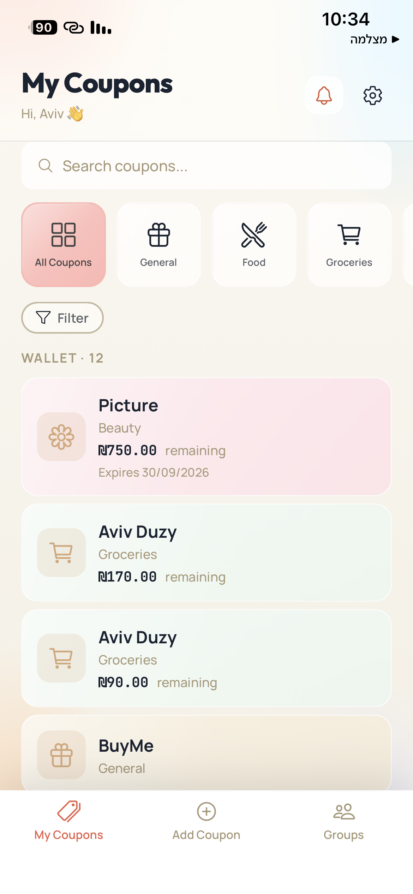
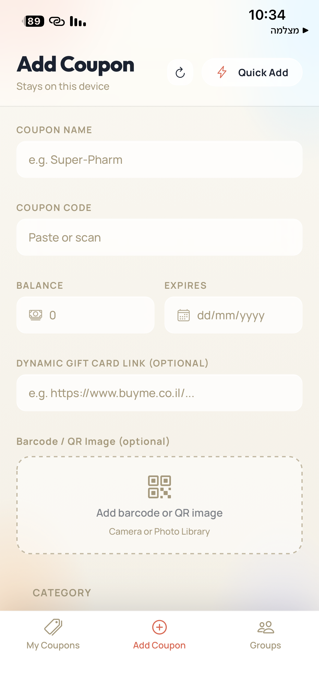
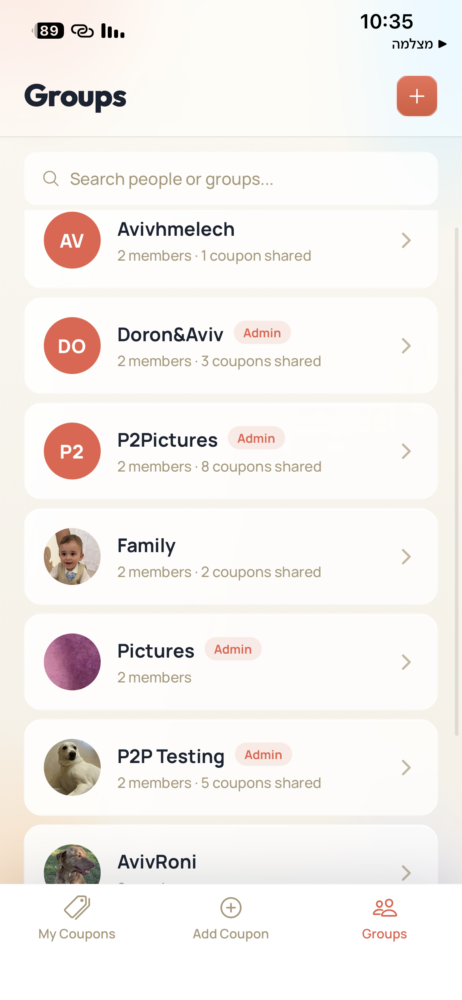
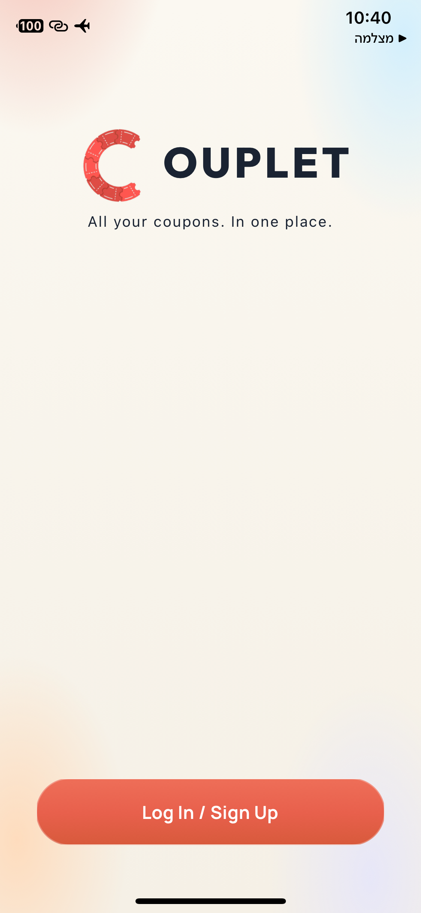

# Couplet

**All your coupons. In one place.**

A mobile coupon wallet. Coupons arrive scattered across email, SMS and chat apps and get forgotten; Couplet collects them in one place, keeps track of what's left on each one, and lets you share them with family and friends.

**Team:** Aviv Duzy, Roni Kenigsberg, Doron Shen-Tzur

<table>
  <tr>
    <td align="center"></td>
    <td align="center"></td>
    <td align="center"></td>
    <td align="center"></td>
  </tr>
  <tr>
    <td align="center"><sub><b>Your wallet</b><br>search, categories, remaining balances</sub></td>
    <td align="center"><sub><b>Add a coupon</b><br>"stays on this device" - and it means it</sub></td>
    <td align="center"><sub><b>Groups</b><br>share with family and friends</sub></td>
    <td align="center"><sub><b>Welcome</b></sub></td>
  </tr>
</table>

---

## The idea the architecture is built around

A coupon code is a bearer token: whoever holds it can redeem it. So Couplet treats codes the way you'd treat cash rather than the way you'd treat data.

**Coupon codes, QR codes and barcode images live on the device.** The server holds metadata only - which coupons exist, who owns them, what they're worth, which groups they're shared with. It has no column for a code.

**When you share a coupon, the code goes straight from your phone to theirs.** The two devices open an encrypted WebRTC data channel and the code (and the barcode image, if there is one) travels across it directly. The server's only role is relaying the connection handshake - the SDP offer/answer and ICE candidates - which it passes through opaquely without inspecting.

**If the recipient is offline, the code is held encrypted.** It's stored AES-256-GCM-encrypted on their notification row with a 72-hour TTL, and deleted the moment their device picks it up. Barcode images get no such fallback at all - an image of a barcode *is* the code in visual form, so it is peer-to-peer or nothing.

The same reasoning drives the rest of the app: the coupon photo scanner runs its OCR model **on the phone**, because a photo of a coupon is a coupon.

---

## Features

### Your wallet
- Add coupons with store, code, category, expiration and balance; edit or delete them any time.
- **Partial redemption** - spend part of a gift card and keep the remainder. Balances are decremented atomically server-side, so two people redeeming the same shared coupon at once can never overdraw it.
- Status tracking (`active` / `expired` / `used`), with expiry reminders.
- Search, category filter and sort (balance, expiry). Searching also reaches coupons other people have shared with you.
- Gift-card links (e.g. BuyMe) open in an in-app browser.
- **Where to use** - nearby branches of a coupon's stores, sorted by distance.

### Four ways to add a coupon
- **Type it in** manually.
- **Paste the text** of a coupon SMS or email - a parser pulls out the store, code, amount and expiration for you to confirm. Hebrew and English.
- **Scan a photo** - pick or shoot a photo of a coupon and an OCR model reads it **on the device**, filling in the same fields. Nothing photographed or recognized ever leaves the phone.
- **Scan your Gmail** - connect a Gmail account and Couplet searches it for coupon emails, extracts a draft coupon from each, and lets you review the source email before saving. See [Gmail scanner setup](docs/gmail-setup.md).

### Sharing with people you trust
- Create groups and invite people by username, email or phone - or find the ones already using Couplet straight from your phone contacts. Invitees accept or decline from their notifications.
- Share a coupon to a group and every member can use it - the code reaches each of them device-to-device.
- Everyone sees the balance change as it's spent, live.
- Edit a shared coupon's code later and the correction is redelivered silently to everyone who has it.
- Revoke a share, or leave a group, at any time.

### Staying in the loop
- Live in-app notifications over a WebSocket while the app is open; OS notifications when it isn't, with a catch-up pass on resume so nothing is missed.
- Tapping a notification takes you straight to the group it's about.
- One-tap **Clear all** that deliberately keeps what you can't get back: pending invitations (the notification *is* the accept/decline) and any coupon code not yet collected.

### Accounts
- Sign up with email or phone, verified by an emailed code, on AWS Cognito.
- Passwords are proven via SRP - the password itself is never transmitted.
- Editable profile with username, phone and photo, visible to your group members.

---

## Architecture

Hybrid by design: a conventional client-server app for identity, metadata and coordination, plus a true peer-to-peer path for the one thing the server must never hold.

```
   Device A  ──── SDP / ICE ────►  Server  ──── SDP / ICE ────►  Device B
  (sharer)                     (signaling only)                (recipient)
      │                                                             ▲
      └──────── encrypted WebRTC data channel: code + image ────────┘
                     (never passes through the server)
```

Two pieces of the client are worth calling out, because both solve the same constraint - the app has to run in **plain Expo Go**, with no custom native build:

- **WebRTC in a hidden WebView.** `react-native-webrtc` requires a custom dev client, so instead the `RTCPeerConnection`s run inside a 1×1 hidden WebView mounted at the app root, driven from React Native by injected JavaScript and message passing. Images are chunked over the data channel in 16 KB frames with backpressure, and the recipient only acknowledges a transfer once the code and image are both safely stored.
- **OCR in a second hidden WebView.** Tesseract.js (a WASM build of an LSTM recognition engine) runs the same way, English and Hebrew, mounted only for the duration of a scan and torn down straight after. It's an independent module - the two bridges share no state and can't reach each other.

---

## Tech Stack

| Layer | Technology |
|---|---|
| Mobile client | React Native 0.86 / Expo SDK 57 - runs in Expo Go, no custom native build |
| Backend | Node.js + Express, deployed on AWS Lambda via `serverless-http` |
| API Gateway | AWS API Gateway HTTP API (REST) + WebSocket API (live notifications, WebRTC signaling) |
| Database | AWS DynamoDB |
| Auth | AWS Cognito (SRP login, email verification, JWTs on every request) |
| P2P transfer | Browser WebRTC `RTCDataChannel` inside a hidden `react-native-webview` |
| On-device OCR | Tesseract.js (WASM, English + Hebrew) in a second hidden WebView |
| Notifications | Live over the WebSocket API while open; local OS notifications (`expo-notifications`) when backgrounded |
| Email scanning | Google OAuth 2.0 + Gmail API (`gmail.readonly`) |
| Store locator | Google Places API ("Where to use") |

---

## Project Structure

```
Couplet/
├── client/                                      # React Native (Expo) mobile app
│   ├── app/                                     # Screens (expo-router)
│   ├── components/                              # UI components + the hidden WebRTC / OCR bridges
│   ├── services/                                # API client, WebRTC, OCR, Cognito, Gmail
│   ├── storage/                                 # On-device storage (codes, images, drafts)
│   └── utils/                                   # Coupon text extraction, formatting
├── server/                                      # Node.js + Express backend (runs on AWS Lambda)
│   └── src/
│       ├── routes/                              # REST endpoints
│       ├── repositories/                        # DynamoDB access
│       ├── services/                            # Shared business logic (e.g. redemption)
│       ├── lib/                                 # Crypto, Gmail, OAuth helpers
│       └── ws/                                  # WebSocket handler (notifications + signaling relay)
├── docs/gmail-setup.md                          # Gmail scanner setup guide
├── .github/workflows/ci.yml                     # Typecheck on client + server, every PR
├── Specification & Design Document - Couplet.pdf
└── CLAUDE.md                                    # Architecture, data model, feature spec (for contributors)
```

---

## How to Run

### Client

**Prerequisites:** Node.js, Expo Go installed on your mobile device.

1. Install dependencies:
   ```bash
   cd client
   npm install
   ```

2. Configure environment:
   ```bash
   cp .env.example .env
   ```
   Fill in the following values in `client/.env`:

   | Variable | Description |
   |---|---|
   | `EXPO_PUBLIC_API_URL` | Base URL of the deployed backend (HTTP API) |
   | `EXPO_PUBLIC_COGNITO_USER_POOL_ID` | AWS Cognito User Pool ID |
   | `EXPO_PUBLIC_COGNITO_CLIENT_ID` | AWS Cognito App Client ID |
   | `EXPO_PUBLIC_WS_URL` | WebSocket API URL - live notifications and WebRTC signaling (optional; without it the app falls back to poll-on-focus and P2P sharing is unavailable) |

3. Start the development server:
   ```bash
   npx expo start
   ```
   Scan the QR code with Expo Go on your device.

---

### Server

The production server runs on **AWS Lambda** - no instance to manage. After code changes:

```bash
cd server && npm run build
```

then package `dist/` and `node_modules/` into a zip and upload it in the Lambda Console → Code → Upload from → .zip file. On PowerShell:

```powershell
Compress-Archive -Path dist, node_modules -DestinationPath lambda.zip -Force
```

**For local development:**

1. Install dependencies:
   ```bash
   cd server
   npm install
   ```

2. Configure environment:
   ```bash
   cp .env.example .env
   ```
   Fill in the following values in `server/.env`:

   | Variable | Description |
   |---|---|
   | `AWS_REGION` | AWS region (e.g. `us-east-1`) |
   | `COGNITO_USER_POOL_ID` | AWS Cognito User Pool ID |
   | `COGNITO_CLIENT_ID` | AWS Cognito App Client ID |
   | `AWS_ACCESS_KEY_ID` / `AWS_SECRET_ACCESS_KEY` / `AWS_SESSION_TOKEN` | AWS credentials - local development only; on Lambda the execution role supplies these |
   | `DYNAMODB_USERS_TABLE` | DynamoDB table name for users |
   | `DYNAMODB_COUPONS_TABLE` | DynamoDB table name for coupons |
   | `DYNAMODB_GROUPS_TABLE` | DynamoDB table name for groups |
   | `DYNAMODB_NOTIFICATIONS_TABLE` | DynamoDB table name for notifications |
   | `DYNAMODB_CONNECTIONS_TABLE` | DynamoDB table for WebSocket connections (PK `connection_id`, GSI `user_id-index`) |
   | `WS_API_ID` + `WS_STAGE` | WebSocket API ID + stage (used to build the push endpoint); or set `WS_API_ENDPOINT` directly |
   | `NOTIFICATION_CODE_KEY` | Base64 32-byte key encrypting coupon codes held for offline recipients (`openssl rand -base64 32`); must match the deployed Lambda's value |
   | `PORT` | Local server port (default: `3000`) |
   | `GOOGLE_PLACES_API_KEY` | Google Places API key (for the store locator) |

   The Gmail scanner needs four more variables - see [Gmail scanner setup](docs/gmail-setup.md).

3. Run the server:
   ```bash
   npm run dev       # hot-reload via ts-node-dev
   # or
   npm run build && npm start   # compile then run
   ```

---

## Scan your inbox

Couplet can connect to a Gmail account and find the coupons already sitting in it: it searches with a keyword query (never downloading a whole mailbox), pulls out a draft coupon - code, store, amount, expiration - from each match, and lets you read the original email before deciding to save it. Extracted fields are returned to your device and never written to the database.

Setup instructions, OAuth configuration and API reference: **[docs/gmail-setup.md](docs/gmail-setup.md)**.

---

## Continuous Integration

Every pull request and every push to `main` runs a typecheck across both the client and server packages ([`.github/workflows/ci.yml`](.github/workflows/ci.yml)).

---

## Project Specification

[Design & Specification Document](./Specification%20%26%20Design%20Document%20-%20Couplet.pdf)
